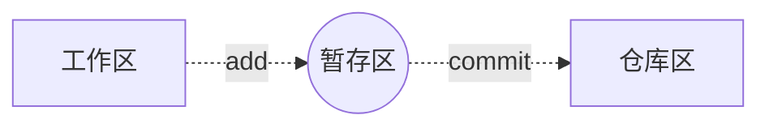

[toc]


## 一）git使用

### 		1.流程图



### 		2.基本概念

+ 工作区：项目所在操作目录，实际操作项目的区域
+ 暂存区：用于记录工作区的工作(修改)内容
+ 仓库区：用于备份工作区的内容 

> 注意：在本地仓库中，git总是希望工作区的内容与仓库区保持一致，而且只有仓库区的内容才能和其他远程仓库交互。

### 		3.初始设置

> 配置命令：git config

+ 配置所有用户：git config --system [选项]

  > 配置文件位置：/etc/gitconfig

+ 配置当前用户：git config --global [选项]

  > 配置文件位置：~/.gitconfig

+ 配置当前项目：git config [选项]

  > 配置文件位置：project/.git/config

> 配置用户名
>
> ```git
> e.g. 将用户名设置为tiny
> git config --system user.name tiny
> ```
>
> 配置用户邮箱
>
> ```git
> e.g. 将邮箱设置为lvze@126.com
> git config --system user.email lvze@126.com
> ```
>
> 配置编译器
>
> ```git
> e.g. 将编译器设置为pycahrm
> git config core.editor pycharm
> ```
>
> 

### 		4.基本命令

+ 初始化仓库

  > git init
  >
  > 意义：将某个项目目录变为git操作目录，生成git本地仓库。即该项目目录可以使用git管理

+ 查看本地仓库状态

  > git status
  >
  > 说明：初始化仓库后默认工作在master分支，当工作区与仓库区不一致时会有提示。

+ 将工作内容记录到暂存区

  > git add [files..]
  >
  > ```git
  > e.g.  将 a b 记录到暂存区
  > git add a b
  > 
  > e.g. 将所有文件（不包含隐藏文件）记录到暂存区
  > git add *
  > ```

+ 取消文件暂存记录

  > git rm --cached [file]

+ 将文件同步到本地仓库

  > git commit [file] -m [message]
  >
  > 说明：-m表示添加一些同步信息，表达同步内容
  >
  > ```git
  > e.g. 将暂存区所有记录同步到仓库区
  > git commit -m 'add files'
  > ```

+ 查看commit日志记录

  > git log
  >
  > git log --pretty=oneline

+ 比较工作区文件和仓库文件差异

  > git diff [file]

+ 将暂存区或者某个commit点文件恢复到工作区

  > git checkout [commit]  --  [file]
  >
  > + --是为了防止误操作，checkout还有切换分支的作用

+ 移动或者删除文件

  > git mv [file] [path]
  >
  > git rm [files]
  >
  > 注意：这两个操作会修改工作区内容，同时将操作记录提交到暂存区


### 		5.版本控制

+ 退回到上一个commit节点

  > git reset --hard HEAD^
  >
  > 注意：一个^表示回退1个版本，以此类推。当版本回退之后工作区会自动和当前commit版本保持一致

+ 退回到指定的commit_id节点

  > git reset --hard [commit_id]

+ 查看所有操作记录

  >  git reflog
  >
  > 注意：最上面的为最新记录，可以利用commit_id去往任何操作位置

+ 创建标签

  > 标签：在项目的重要commit位置添加快照，保存当时的工作状态，一般用于版本的迭代。

  > git tag  [tag_name] [commit_id] -m [message]
  >
  > 说明：commit_id可以不写则默认标签表示最新的commit_id位置，message也可以不写，但是最好添加
  >
  > ```
  > e.g. 在最新的commit出添加标签v1.0
  > git tag v1.0 -m '版本1'
  > ```

+ 查看标签

  > git tag 查看标签列表
  >
  > git show [tag_name] 查看标签详细信息

+ 去往某个标签节点

  > git reset --hard [tag]

+ 删除标签

  > git tag -d [tag]

### 		6.保存工作区


